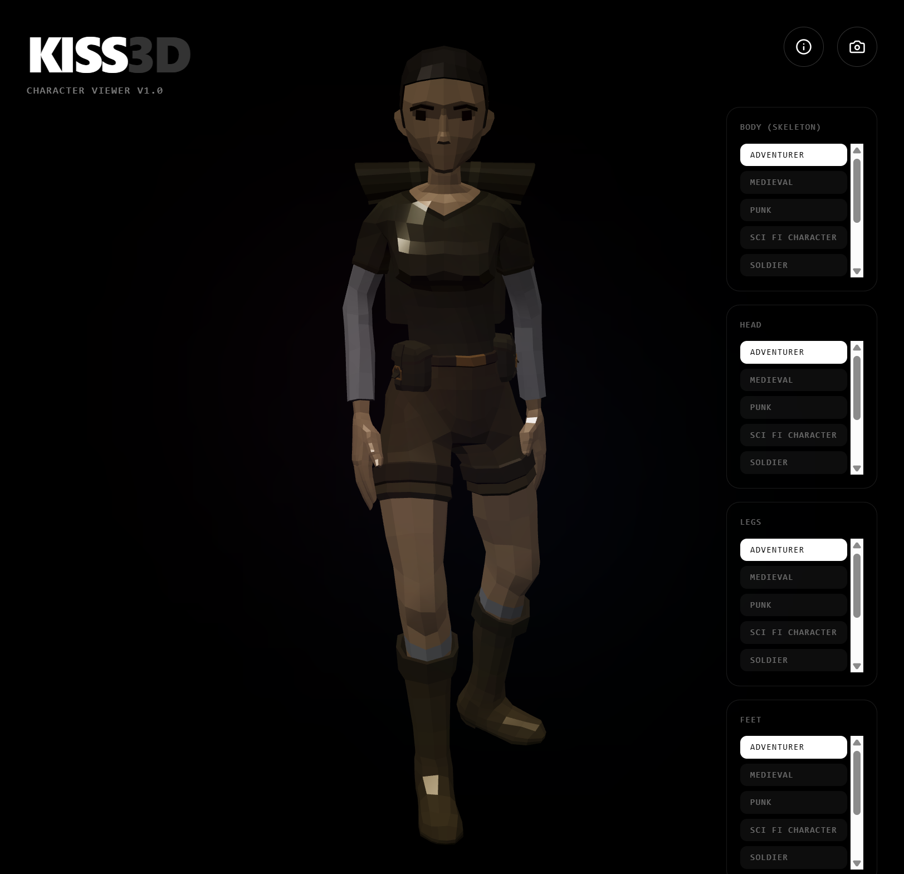

# Kiss3D

Browser **3D model viewer** for bundled glTF/glB characters, built with **Babylon.js**, **React 19**, **Vite 6**, **TypeScript**, and **Tailwind CSS v4**.



## Features

- **Mix & match** — Choose **body, head, legs, and feet** independently from characters listed in `manifest.json`. The **body** sets the skeleton; other parts are skinned to that rig (`src/characterParts.ts` maps glTF mesh names).
- **Scenes** — Studio, jungle, tomb, sunset, neon, and arctic lighting presets on the Babylon scene.
- **Camera** — Orbit controls (drag to rotate, scroll to zoom).
- **Static pose** — Animation groups are disposed after load (bind pose only).

## Prerequisites

- [Node.js](https://nodejs.org/) (LTS recommended)

## Setup

```bash
npm install
```

No environment variables are required for local development.

## Scripts

| Command | Description |
|---------|-------------|
| `npm run dev` | Dev server (port **3000**, host `0.0.0.0`). |
| `npm run build` | Production build to `dist/`. |
| `npm run preview` | Preview the production build locally. |
| `npm run lint` | Typecheck with `tsc --noEmit`. |
| `npm run list-meshes` | Print glTF mesh/node names for every `.glb` in `public/models` (for updating `characterParts.ts`). |
| `npm run clean` | Remove `dist/` (Unix-style `rm`; on Windows use `rmdir /s /q dist` if needed). |

## Project layout

```
src/
  App.tsx              # UI + per-slot character picks
  main.tsx             # React entry
  index.css            # Global styles (Tailwind)
  modelManifest.ts     # Manifest fetch
  characterParts.ts    # Per-character mesh names + file mapping
  compositeCharacter.ts# Load body GLB + retarget part meshes from other GLBs
  components/
    BabylonScene.tsx   # Engine, lighting, composite loader
public/
  models/
    *.glb              # Character assets (see manifest.json)
    manifest.json      # Model list — add a row when you add a new file
metadata.json          # App title/description metadata
```

## Development notes

- **HMR**: In `vite.config.ts`, set `DISABLE_HMR=true` to turn off Hot Module Replacement (useful in constrained or agent-driven environments).

## License

Private project (`"private": true` in `package.json`).
